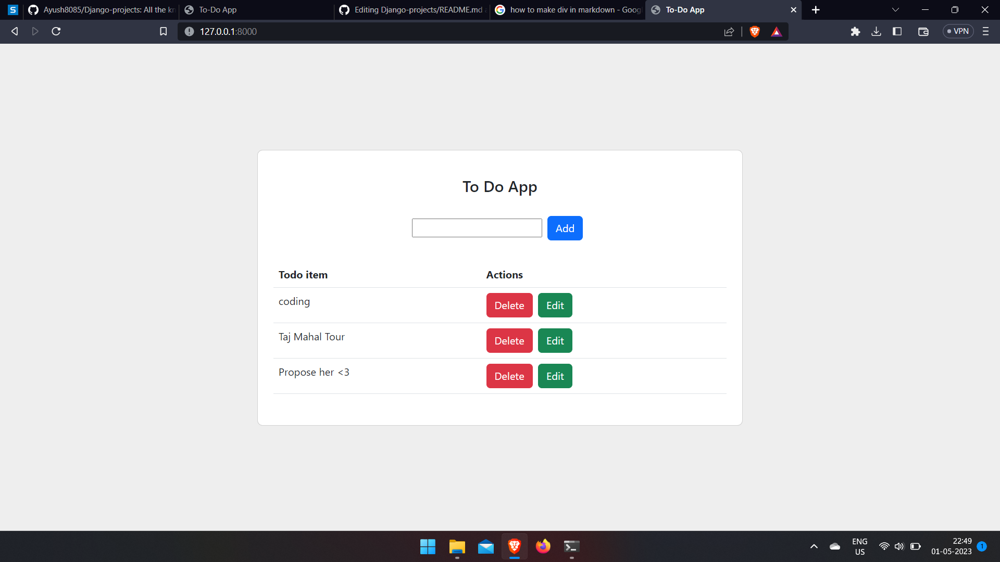

# Django-projects

**Note :- I have only done backend part, not the frontend.**

**Run command in Shell/Terminal.**
> python manage.py runserver

## 1. Registration Form

A user can login, signup and logout from this form.

   
 

## 2. Todo List

A user can add, edit and update tasks.

